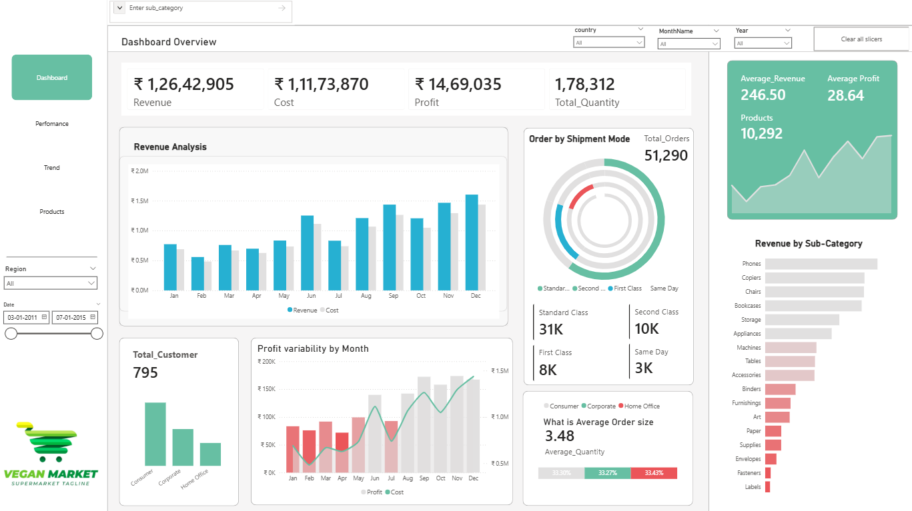

# 📊 Superstore Sales Analysis Dashboard (Power BI)

## 📌 Problem Statement

Retail businesses generate large volumes of sales data, but extracting meaningful insights is critical for improving profitability and decision-making. This project analyzes Superstore sales data to identify revenue trends, profit drivers, and regional performance.

---

## 📁 Dataset Overview

* Dataset includes:

  * Orders, Sales, Profit
  * Customer Segments
  * Product Categories & Sub-categories
  * Regional and State-level data
* Data was cleaned and transformed for analysis

---

## 📊 Key KPIs

* Total Sales
* Total Profit
* Profit Margin (%)
* Sales by Category & Sub-category
* Region-wise Performance
* Top Performing Products

---

## 📸 Dashboard Preview

### Overview

---

## 🔍 Key Insights

* A few product categories contribute to the majority of total sales, indicating key revenue drivers
* Certain regions generate high sales but lower profit, highlighting cost inefficiencies
* Discounts significantly impact profitability in specific categories
* A small percentage of products contribute disproportionately to total profit (Pareto effect)

---

## 🧠 Business Impact

* Helps identify **high-profit and low-profit segments**
* Supports **pricing and discount strategy optimization**
* Enables better **inventory and product planning**
* Assists in improving **regional performance strategies**

---

## 🛠 Tools & Technologies

* Power BI (Dashboarding & Visualization)
* SQL / Excel (Data Cleaning & Preparation)

---

## 📊 Data Handling Note

A sample dataset is provided in this repository.
Full dataset available via external link (if required).

---

## 🚀 How to Use

1. Download `.pbix` file
2. Open in Power BI Desktop
3. Explore interactive visuals

---

## 👨‍💻 Author

Anubhav Upadhyay
Aspiring Data Analyst | SQL | Power BI | Python | AI
